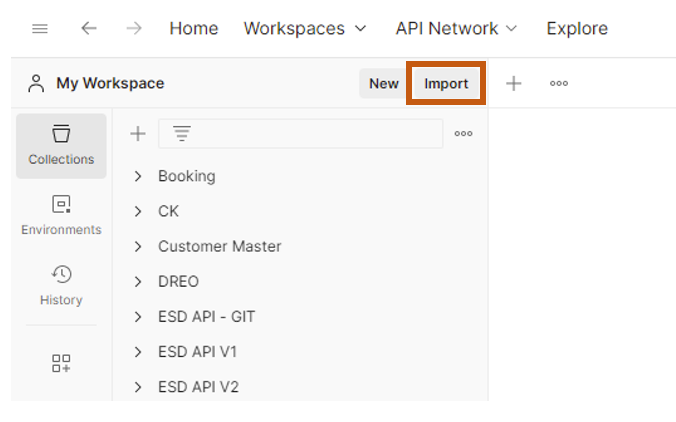
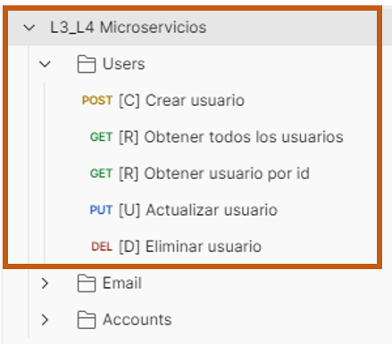
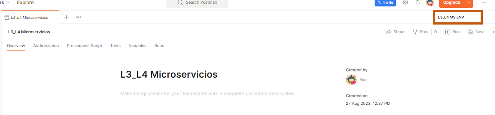

# Laboratorios 3 y 4 de Microservicios

## Antes de la sesión

### Instalaciones Obligatorias

- **Postgres**: Descargar la versión 15 de [aquí](https://www.enterprisedb.com/downloads/postgres-postgresql-downloads).

- **Postman**: Descargar desde [este enlace](https://www.postman.com/downloads/).

### Instalaciones Opcionales

Durante el laboratorio, se utilizará **IntelliJ IDEA** como IDE principal. Sin embargo, si lo prefieres, también puedes trabajar con **STS**. Puedes descargar IntelliJ IDEA Community Edition desde [este enlace](https://www.jetbrains.com/idea/download/).

Durante el laboratorio, también utilizaremos **DBeaver** como cliente de base de datos. Si lo deseas, puedes utilizar el cliente de tu preferencia. Descarga DBeaver Community Edition desde [aquí](https://dbeaver.io/download/).

El uso de un IDE u otro, así como de un cliente de base de datos, es una cuestión de preferencia personal. Utiliza aquellos con los que te sientas más cómodo.

### Pruebas de Postman

1. Clona este repositorio en tu máquina local.

2. Accede a la carpeta "Postman collection".

3. Dentro de esta carpeta, encontrarás un archivo con extensión .json. Este archivo contiene una colección exportada de Postman.

4. Importa la colección en Postman:
   - Abre Postman.
   - Haz clic en el botón "Import" en la esquina superior izquierda.
   - Selecciona el archivo .json de la carpeta "Postman collection".

5. Una vez importada la colección, explora la carpeta "Users" y verifica que puedes llamar a los distintos endpoints proporcionados.

**Nota**: Para probar los endpoints (Paso 5), se requiere importar también el archivo de variables de ambiente, el cual ha sido enviado por correo electrónico a los estudiantes. Asimismo, se debe seleccionar el ambiente en la parte superior derecha.

## Durante la sesión

### Desarrollo del Microservicio de Cuentas (Accounts)

Durante la sesión de laboratorio, trabajaremos en la creación de un microservicio en Java y Spring como parte de una arquitectura de microservicios.

**Nota**: Esta sección proporciona solo un resumen de lo que se abordará en el laboratorio. Se recomienda asistir a la sesión para obtener detalles completos y guía práctica.
